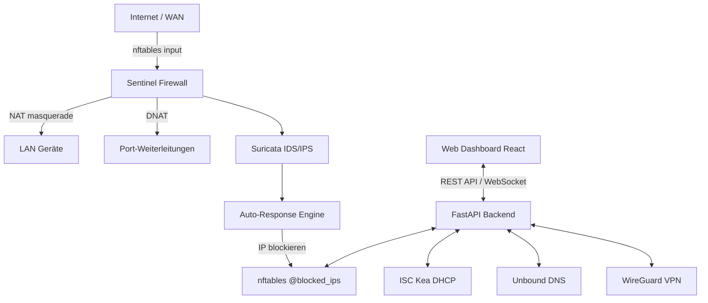

# 🛡️ Sentinel Firewall

[](https://python.org)
[](https://fastapi.tiangolo.com)
[](https://react.dev)
[](LICENSE)
[](https://ubuntu.com)

**Self-hosted open-source network firewall with intelligent threat detection, web dashboard, and zero-configuration NAT.**

> Built for home-lab enthusiasts and small businesses — no cloud dependency, no subscription, full control.

---

## Features

| Feature | Technology |
|---------|------------|
| 🔥 Stateful Firewall | nftables (kernel-native) |
| 🌐 NAT / Masquerading | nftables postrouting |
| 🔀 Port Forwarding | nftables DNAT |
| 📡 DHCP Server | ISC Kea |
| 🔍 DNS Resolver | Unbound |
| 🔒 VPN | WireGuard |
| 🚨 IDS/IPS | Suricata + custom ML |
| 📊 Web Dashboard | React 18 + Tailwind CSS |
| 🌍 Internationalization | i18next (DE / EN) |
| 🔔 Alerts | Telegram + E-Mail |

---

## Quick Install

```bash
# Ubuntu 24.04 LTS — als root ausführen
curl -sSL https://raw.githubusercontent.com/speckitime/sentinel-firewall/main/sentinel/installer.sh | sudo bash
```

Oder manuell:

```bash
git clone https://github.com/speckitime/sentinel-firewall.git
cd sentinel-firewall/sentinel
sudo bash installer.sh
```

Nach der Installation: `https://<LAN-Gateway-IP>` im Browser öffnen.

→ Vollständige Installationsanleitung: [docs/INSTALL.md](docs/INSTALL.md)

---

## Architecture



---

## Requirements

- Ubuntu 24.04 LTS (bare-metal, VM, oder LXC)
- Mindestens 2 Netzwerk-Interfaces (WAN + LAN)
- 2 vCPU, 2 GB RAM, 10 GB Disk
- Root-Zugriff

---

## Screenshots

> Dashboard, Firewall-Regeln, NAT/Port-Forwarding, IDS-Alerts — Screenshots folgen nach erster stabiler Version.

---

## Contributing

Pull Requests willkommen! Bitte:
1. Fork erstellen
2. Feature-Branch: `git checkout -b feat/mein-feature`
3. Commits: [Conventional Commits](https://www.conventionalcommits.org/) Format
4. PR öffnen gegen `main`

---

## License

MIT License — © 2026 Leon Boldt (Boldt-EDV)

Siehe [LICENSE](../LICENSE) für Details.
